<!--
theme
&title_color=8888c8   # 主题色
&text_color=69aa66    # 正文色
&locale=cn            # 本地化
&bg_color=00000000    # 透明背景
-->

# My Blog

https://d5v.cc/

  <!-- Most Used Languages -->
  

  <!-- GitHub Stats -->
  

## 🛠️ Tools, Frameworks & Technology Stack

### 🌐 Frontend

  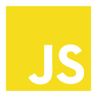
  
  
  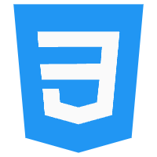
  
  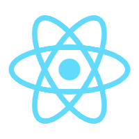
  

### 🖥️ Backend

  
  
  
  
  
  

### 💾 Database

  
  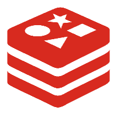
  
  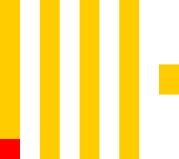
  
  
  

### 🔄 Middleware / Infrastructure / Framework

  
  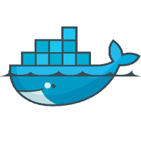
  
  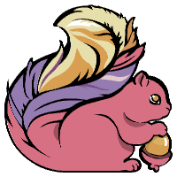
  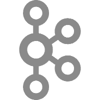
  
  
  

### 🔧 DevOps / Tools

  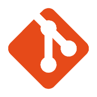
  
  
  
  
  
  
  
  

### 🎨 Design

  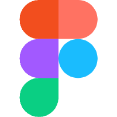
  
  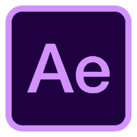
  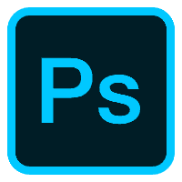

