<!--
theme
&title_color=8888c8   # 主题色
&text_color=69aa66    # 正文色
&locale=cn            # 本地化
&bg_color=00000000    # 透明背景
-->

# About Me

Hello everyone, I am deadmau5v.

20 years old, a student of China.  😊

I am a full-stack developer, familiar with a variety of programming languages and technologies.

In frontend development, I mainly use JavaScript, TypeScript, HTML, and CSS, and I am also familiar with the React framework. 🌐

In backend development, I am familiar with Go, Python, and Scala, and have used frameworks like Gin, Django, and Flask. 🔧

In terms of databases, I am familiar with MySQL and Redis, and have experience with Clickhouse, Hive, Hbase, and SQLite. 🗄️

In terms of middleware, infrastructure, and frameworks, I am familiar with Hadoop, Docker, Flink, Kafka, and Flume. I also frequently use Miniconda. ⚙️

In terms of DevOps and tools, I am familiar with Git, VSCode, IDEA, Pycharm, WebStorm, GoLand, and Gateway. I have also used Navicat, Chrome, and Clash. 🛠️

In terms of design, I am familiar with Figma and C4D, and have used Ae, Ps, Ai, Pr, and Xd. 🎨

I am always striving to learn and improve, hoping to play a bigger role in future projects. Thank you all. 🚀

 

<!-- 最常用的语言 -->

<!-- Github统计 -->

 

## Tools, Frameworks, Technology Stack

### Frontend

<h3>
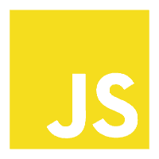

</h3>

### Backend

<h3>
    
    
    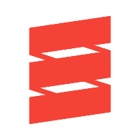
    
    
    
    
</h3>

### Database
<h3>
    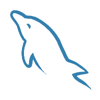
    
    
    
    
    
    
</h3>

### Middleware / Infrastructure / Framework

<h3>
    
    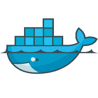
    
    
    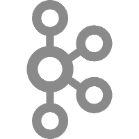
    
    
    
</h3>

### DevOps / Tools

<h3> 
    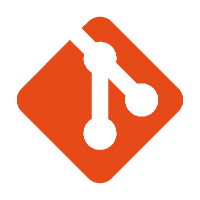
    
    
    
    
    
    
    
    
    
    
    
</h3>

### Design

<h3>
    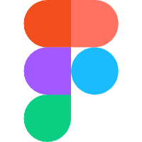
    
    
    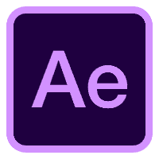
    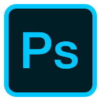
    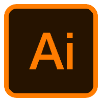
    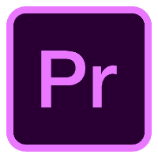
    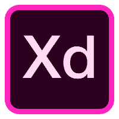
</h3>
